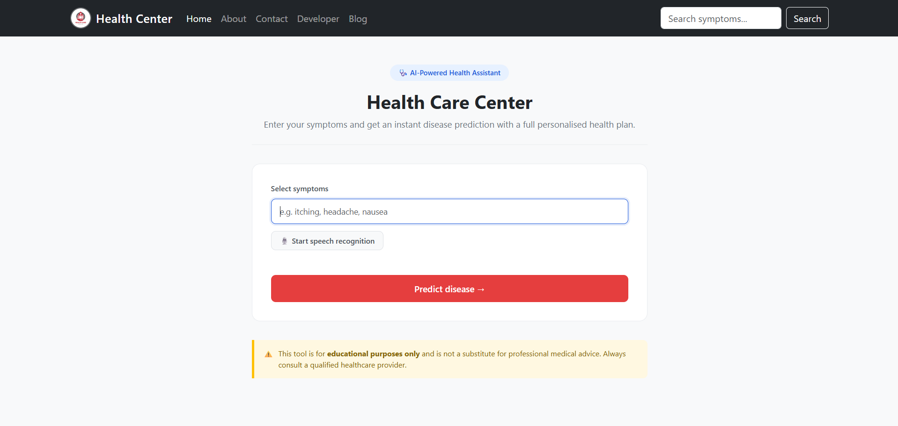
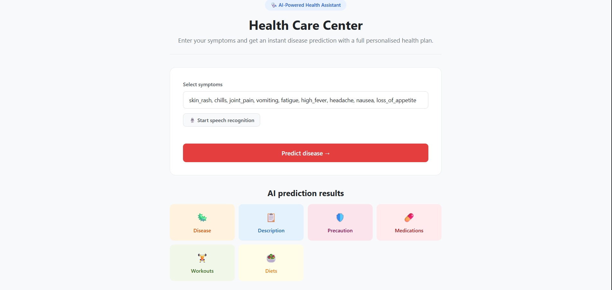
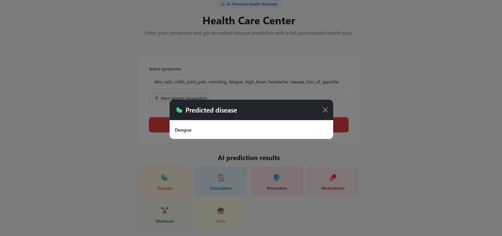
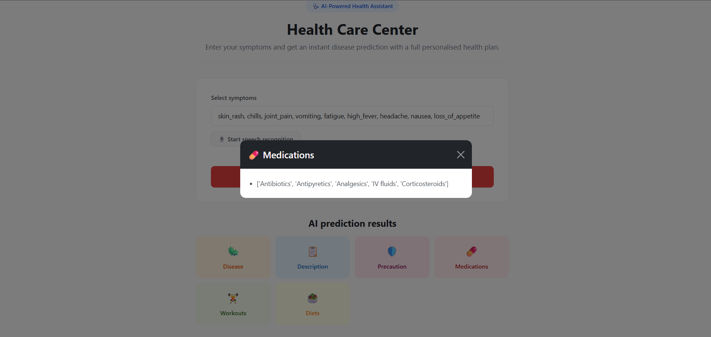
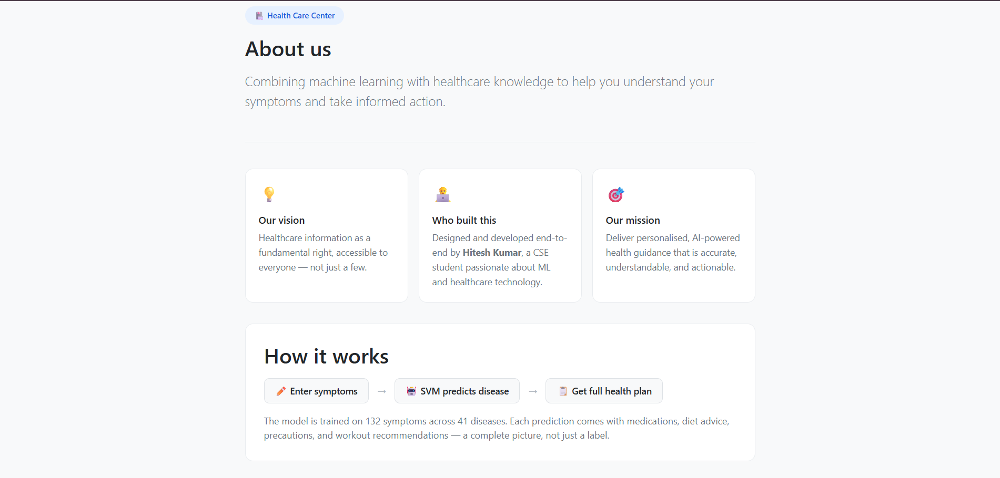

# 🩺 Medicine Recommendation System

[](https://python.org)
[](https://flask.palletsprojects.com)
[](https://scikit-learn.org)
[](https://getbootstrap.com)
[](LICENSE)
[](https://medicine-recommendation-system-r2k5.onrender.com)

> 🌐 **Live Demo:** [https://medicine-recommendation-system-r2k5.onrender.com](https://medicine-recommendation-system-r2k5.onrender.com)

An ML-powered web application that predicts diseases from user-entered symptoms and delivers personalised health recommendations — including medications, precautions, diet plans, and workouts — using a trained **Support Vector Machine (SVM)** classifier.

---

## 📸 Screenshots

### Home Page


### Prediction Results


### Predicted Disease


### Medications


### About Page


---

## ✨ Features

- 🔍 **Disease Prediction** — Predicts from 41 diseases based on 132 possible symptoms
- 💊 **Medication Suggestions** — Recommends relevant medications for the predicted condition
- 🥗 **Diet Plans** — Provides tailored dietary recommendations
- 🏋️ **Workout Advice** — Suggests appropriate physical activities
- 🛡️ **Precautionary Measures** — Lists actionable steps to manage or prevent the condition
- 🎙️ **Speech Recognition** — Enter symptoms hands-free via voice input
- ⚠️ **Input Validation** — Handles unknown symptoms gracefully with clear error messages
- 🌐 **Responsive UI** — Built with Bootstrap 5, works on all screen sizes

---

## 🛠️ Tech Stack

| Layer | Technology |
|---|---|
| Backend | Python, Flask |
| ML Model | Scikit-learn (SVM Classifier) |
| Data Processing | Pandas, NumPy |
| Frontend | HTML, CSS, Bootstrap 5, Jinja2 |
| Model Storage | Pickle (.pkl) |

---

## 📁 Project Structure

```
Medicine-Recommendation-System/
│
├── datasets/                        
│   ├── symtoms_df.csv              
│   ├── precautions_df.csv           
│   ├── workout_df.csv               
│   ├── description.csv              
│   ├── medications.csv              
│   ├── diets.csv                    
│   ├── Symptom-severity.csv          
│   └── Training.csv                
│
├── models/
│   ├── svc.pkl                     
│   └── Medicine Recommendation System.ipynb  
│
├── screenshots/                     
│   ├── home.png
│   ├── prediction.png
│   ├── disease.png
│   ├── medications.png
│   └── about.png
│
├── static/                         
├── templates/                       
│   ├── index.html                   
│   ├── about.html                   
│   ├── contact.html                 
│   ├── developer.html              
│   └── blog.html                    
│
├── main.py                         
└── README.md
```

---

## 🚀 Getting Started

### Prerequisites

- Python 3.8+
- pip

### Installation

```bash
# 1. Clone the repository
git clone https://github.com/HiteshKumar360/Medicine-Recommendation-System.git
cd Medicine-Recommendation-System

# 2. Create and activate virtual environment
python -m venv .venv

# Windows
.venv\Scripts\activate

# Mac/Linux
source .venv/bin/activate

# 3. Install dependencies
pip install flask scikit-learn pandas numpy

# 4. Run the application
python main.py
```

### Access

For local development:
http://127.0.0.1:5000

Live deployment: https://medicine-recommendation-system-r2k5.onrender.com

## 📊 How It Works

```
User Input (symptoms)
        ↓
Symptom Encoding → 132-dim binary vector
        ↓
SVM Classifier → Predicts Disease (from 41 classes)
        ↓
Dataset Lookup → Fetch recommendations
        ↓
Output: Disease + Description + Medications + Diet + Precautions + Workout
```

1. User enters comma-separated symptoms (e.g. `fatigue, headache, nausea`)
2. Symptoms are encoded into a binary feature vector matching the model's input shape
3. The trained SVM classifier predicts the most likely disease
4. Helper functions query CSV datasets to fetch matching recommendations
5. Results are rendered dynamically via Bootstrap modals

---

## 🤖 ML Model Details

| Property | Value |
|---|---|
| Algorithm | Support Vector Machine (SVC) |
| Input Features | 132 symptoms (binary encoded) |
| Output Classes | 41 diseases |
| Training Data | Symptom-disease dataset (Training.csv) |
| Serialization | Pickle (.pkl) |

---

## 📋 Sample Symptoms to Try

| Disease | Symptoms to Enter |
|---|---|
| Diabetes | `fatigue, weight_loss, restlessness, lethargy, irregular_sugar_level, polyuria` |
| Dengue | `skin_rash, chills, joint_pain, vomiting, fatigue, high_fever, headache, nausea` |
| Malaria | `chills, vomiting, high_fever, sweating, headache, nausea, muscle_pain` |
| Common Cold | `continuous_sneezing, chills, fatigue, cough, headache, runny_nose` |
| Migraine | `headache, blurred_and_distorted_vision, nausea, vomiting, fatigue` |

> **Note:** Type symptoms with underscores and separate multiple symptoms with commas.

---

## ⚠️ Disclaimer

> This application is intended for **educational and informational purposes only**.
> It is **not** a substitute for professional medical advice, diagnosis, or treatment.
> Always consult a qualified healthcare provider for any medical concerns.

---

## 👨‍💻 Developer

**Hitesh Kumar**  
BTech CSE — VIT Bhopal University

[](https://github.com/HiteshKumar360)
[](https://www.linkedin.com/in/hitesh-kumar-12ba3228a/)
[](mailto:kumhit871@gmail.com)

---

## 📄 License

This project is licensed under the [MIT License](LICENSE).


